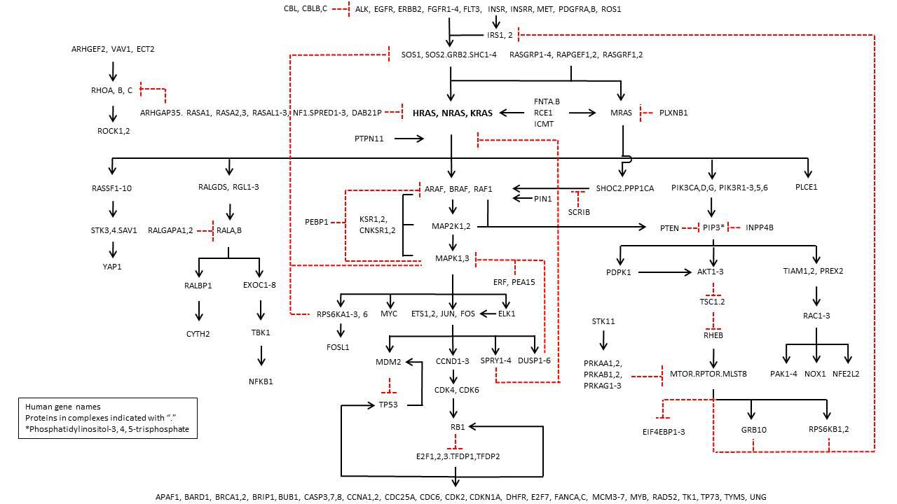
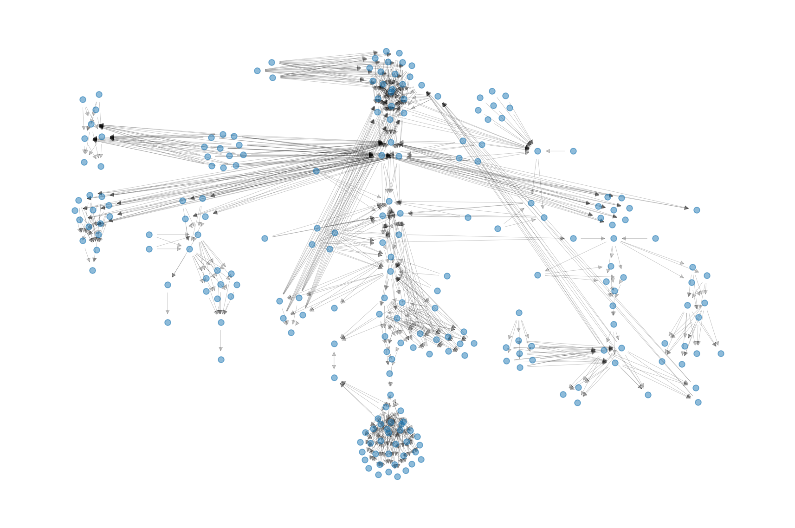
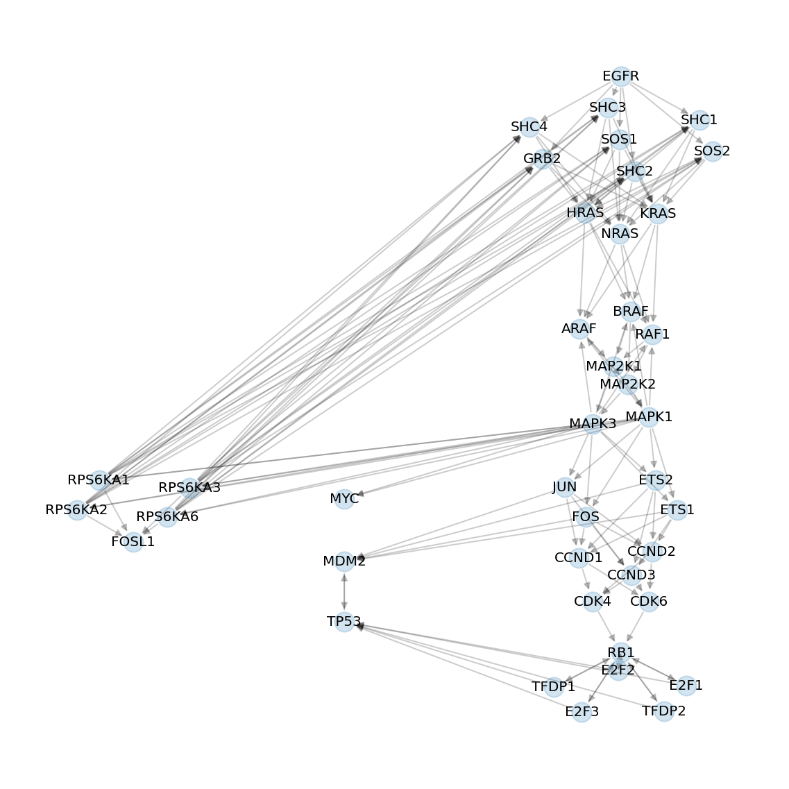

# *nciraspw* – The NCI Ras pathway as a GraphViz Python object.

[](https://github.com/jhrcook/nciraspw/actions/workflows/tests.yaml)
[](https://codecov.io/gh/jhrcook/nciraspw)

The [National Cancer Institute (NCI) Ras pathway](https://www.cancer.gov/research/key-initiatives/ras/ras-central/blog/2015/ras-pathway-v2) is a manually-curated diagram of the Ras signaling pathway.
This Python package provides easy access to the data files and the pathway as a [NetworkX](https://networkx.org/) graph object.



## Installation

This package is not released on PyPI at the moment, but it can be installed from GitHub using the following command.

```bash
pip install git+https://github.com/jhrcook/nciraspw.git
```

## Use

### Raw data files

The raw data for the pathway is bundled with the package and available through the `read_data` module.
The read functions are demonstrated below.


```python
from nciraspw import read_data
```

A table of gene names, protein names, and alternative gene names are provided on the website.


```python
read_data.read_gene_names().head()
```


<div>
<style scoped>
    .dataframe tbody tr th:only-of-type {
        vertical-align: middle;
    }

    .dataframe tbody tr th {
        vertical-align: top;
    }

    .dataframe thead th {
        text-align: right;
    }
</style>
<table border="1" class="dataframe">
  <thead>
    <tr style="text-align: right;">
      <th></th>
      <th>gene_name</th>
      <th>protein_name</th>
      <th>alt_gene_names</th>
    </tr>
  </thead>
  <tbody>
    <tr>
      <th>0</th>
      <td>AKT1</td>
      <td>RAC-alpha serine/threonine-protein kinase</td>
      <td>AKT, CWS6, PKB, PKB-ALPHA, PRKBA, RAC, RAC-ALPHA</td>
    </tr>
    <tr>
      <th>1</th>
      <td>AKT2</td>
      <td>RAC-beta serine/threonine-protein kinase</td>
      <td>HIHGHH, PKBB, PKBBETA, PRKBB, RAC-BETA</td>
    </tr>
    <tr>
      <th>2</th>
      <td>AKT3</td>
      <td>RAC-gamma serine/threonine-protein kinase</td>
      <td>MPPH, MPPH2, PKB-GAMMA, PKBG, PRKBG, RAC-PK-ga...</td>
    </tr>
    <tr>
      <th>3</th>
      <td>ALK</td>
      <td>anaplastic lymphoma receptor tyrosine kinase; ...</td>
      <td>CD246, NBLST3</td>
    </tr>
    <tr>
      <th>4</th>
      <td>APAF1</td>
      <td>apoptotic peptidase activating factor 1</td>
      <td>APAF-1, CED4</td>
    </tr>
  </tbody>
</table>
</div>


The pathway had many proteins grouped together.
I transcribed these groups into a table along with their relative $x$ and $y$ locations.


```python
read_data.read_node_groups().head()
```


<div>
<style scoped>
    .dataframe tbody tr th:only-of-type {
        vertical-align: middle;
    }

    .dataframe tbody tr th {
        vertical-align: top;
    }

    .dataframe thead th {
        text-align: right;
    }
</style>
<table border="1" class="dataframe">
  <thead>
    <tr style="text-align: right;">
      <th></th>
      <th>group_id</th>
      <th>x</th>
      <th>y</th>
      <th>node</th>
    </tr>
  </thead>
  <tbody>
    <tr>
      <th>0</th>
      <td>1</td>
      <td>2302</td>
      <td>0</td>
      <td>CBL</td>
    </tr>
    <tr>
      <th>1</th>
      <td>1</td>
      <td>2302</td>
      <td>0</td>
      <td>CBLB</td>
    </tr>
    <tr>
      <th>2</th>
      <td>1</td>
      <td>2302</td>
      <td>0</td>
      <td>CBLC</td>
    </tr>
    <tr>
      <th>3</th>
      <td>2</td>
      <td>3374</td>
      <td>0</td>
      <td>ALK</td>
    </tr>
    <tr>
      <th>4</th>
      <td>2</td>
      <td>3374</td>
      <td>0</td>
      <td>EGFR</td>
    </tr>
  </tbody>
</table>
</div>


I also transcribed the edges from the pathway to a data frame, recording the links between node groups and the type of interaction.


```python
read_data.read_node_group_interactions().head()
```


<div>
<style scoped>
    .dataframe tbody tr th:only-of-type {
        vertical-align: middle;
    }

    .dataframe tbody tr th {
        vertical-align: top;
    }

    .dataframe thead th {
        text-align: right;
    }
</style>
<table border="1" class="dataframe">
  <thead>
    <tr style="text-align: right;">
      <th></th>
      <th>from_grp</th>
      <th>to_grp</th>
      <th>interaction_type</th>
    </tr>
  </thead>
  <tbody>
    <tr>
      <th>0</th>
      <td>1</td>
      <td>2</td>
      <td>inhibitory</td>
    </tr>
    <tr>
      <th>1</th>
      <td>2</td>
      <td>4</td>
      <td>activating</td>
    </tr>
    <tr>
      <th>2</th>
      <td>3</td>
      <td>4</td>
      <td>activating</td>
    </tr>
    <tr>
      <th>3</th>
      <td>4</td>
      <td>7</td>
      <td>activating</td>
    </tr>
    <tr>
      <th>4</th>
      <td>4</td>
      <td>9</td>
      <td>activating</td>
    </tr>
  </tbody>
</table>
</div>


The group interactions can be expanded to the individual proteins, too.


```python
read_data.read_edge_list().head()
```


<div>
<style scoped>
    .dataframe tbody tr th:only-of-type {
        vertical-align: middle;
    }

    .dataframe tbody tr th {
        vertical-align: top;
    }

    .dataframe thead th {
        text-align: right;
    }
</style>
<table border="1" class="dataframe">
  <thead>
    <tr style="text-align: right;">
      <th></th>
      <th>from</th>
      <th>to</th>
      <th>interaction_type</th>
    </tr>
  </thead>
  <tbody>
    <tr>
      <th>0</th>
      <td>CBL</td>
      <td>ALK</td>
      <td>inhibitory</td>
    </tr>
    <tr>
      <th>1</th>
      <td>CBL</td>
      <td>EGFR</td>
      <td>inhibitory</td>
    </tr>
    <tr>
      <th>2</th>
      <td>CBL</td>
      <td>ERBB2</td>
      <td>inhibitory</td>
    </tr>
    <tr>
      <th>3</th>
      <td>CBL</td>
      <td>FGFR1</td>
      <td>inhibitory</td>
    </tr>
    <tr>
      <th>4</th>
      <td>CBL</td>
      <td>FGFR2</td>
      <td>inhibitory</td>
    </tr>
  </tbody>
</table>
</div>


### Pathway graph object

The pathway is also available as a NetworkX directed graph object.


```python
import matplotlib.pyplot as plt
import networkx as nx

from nciraspw.layout import nci_ras_pathway_positions
from nciraspw.ras_pw_graph import ras_pathway_graph

%matplotlib inline
%config InlineBackend.figure_format='retina'
```


```python
ras_pw = ras_pathway_graph()
print(ras_pw)
```

    DiGraph named 'NCI Ras pathway 2.0' with 228 nodes and 933 edges


```python
list(ras_pw.nodes.data())[0]
```


    ('AKT1',
     {'protein_name': 'RAC-alpha serine/threonine-protein kinase',
      'alt_gene_names': {'AKT',
       'CWS6',
       'PKB',
       'PKB-ALPHA',
       'PRKBA',
       'RAC',
       'RAC-ALPHA'},
      'group_id': '41'})


```python
list(ras_pw.edges.data())[0]
```


    ('AKT1', 'TSC1', {'interaction': 'inhibitory'})


To help with visualizing the pathway, I have indlcuded a custom layout function that uses the node group locations as starting points and then spreads out the individual nodes.
The amount of spread can be controlled by the `scale` and `eps` parameters in the layout function.


```python
fig, ax = plt.subplots(figsize=(12, 8))

layout = nci_ras_pathway_positions(ras_pw, scale=50, eps=0.5)
nx.draw_networkx_edges(
    ras_pw, pos=layout, alpha=0.2, width=0.5, min_source_margin=2, min_target_margin=2
)
nx.draw_networkx_nodes(ras_pw, pos=layout, alpha=0.5, node_size=40)

ax.axis("off")
fig.tight_layout()
plt.show()
```





Below is just a demonstration of manipulating the pathway graph.
I extract the core of the pathway and some off-shoots to key downstream effectors.


```python
from itertools import product

proteins = {"EGFR", "KRAS", "BRAF", "MAPK1", "RB1", "TP53", "MDM2", "FOSL1", "MYC"}
path_nodes = proteins.copy()
for a, b in product(proteins, proteins):
    if a == b:
        continue
    try:
        for path in nx.all_shortest_paths(ras_pw, a, b):
            path_nodes = path_nodes.union(path)
    except nx.NetworkXNoPath:
        ...

sub_ras_gr = nx.subgraph(ras_pw, path_nodes)
print(sub_ras_gr)
```

    DiGraph named 'NCI Ras pathway 2.0' with 41 nodes and 144 edges


```python
fig, ax = plt.subplots(figsize=(8, 8))

subgraph_pos = nci_ras_pathway_positions(sub_ras_gr, scale=25, eps=1)
nx.draw_networkx_edges(sub_ras_gr, pos=subgraph_pos, alpha=0.2)
nx.draw_networkx_nodes(sub_ras_gr, pos=subgraph_pos, alpha=0.2, node_size=200)
nx.draw_networkx_labels(sub_ras_gr, pos=subgraph_pos, font_size=10)

ax.axis("off")
fig.tight_layout()
plt.show()
```



